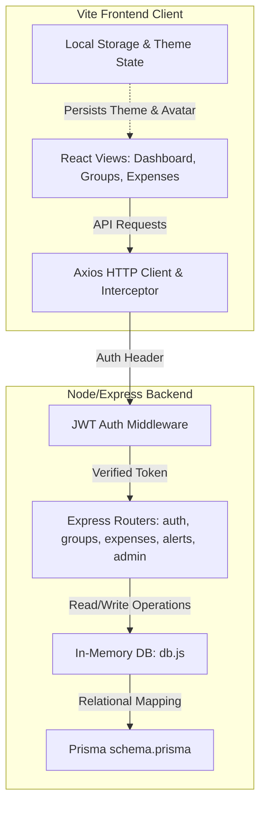

# 🏗️ System Architecture & Database Design

This document details the architectural layout of SplitFlow Pro, describing how data flows from the frontend to the Express backend and how calculations are handled.

---

## 🗺️ System Layout Diagram

Below is the mapping of components and how they interact:

---

## 🧮 Debt Reconciliation Algorithm

SplitFlow Pro uses a **Greedy Debt Minimization Algorithm** to resolve group expenses and calculate peer-to-peer settlements. Instead of everyone paying each other back individually, the system resolves all balances down to the minimum possible number of transaction transfers.

### Algorithm Steps:
1. **Net Balances Calculation**: 
   For each member in a group, calculate their net balance:
   $$\text{Net Balance} = \text{Total Paid} - \text{Total Share}$$
   - Positive balance: Member is owed money (**Creditor**).
   - Negative balance: Member owes money (**Debtor**).
   - Zero balance: Member is fully settled.

2. **Partition & Sort**:
   - Separate members into two pools: **Debtors** and **Creditors**.
   - Sort both pools in descending order of absolute value.

3. **Greedy Matching**:
   - Match the largest debtor with the largest creditor.
   - The transaction amount is:
     $$\text{Transfer Amount} = \min(|\text{Debtor Balance}|, \text{Creditor Balance})$$
   - Update both balances:
     - Deduct the transfer amount from the debtor's balance.
     - Deduct the transfer amount from the creditor's balance.
   - Record the transfer transaction (e.g., *"Rahul owes Priya $25.00"*).
   - Remove any member whose balance becomes `0` from their respective pool.
   - Repeat until all balances are resolved.

---

## 🛢️ Database Schema (Prisma)

The application includes a production-ready relational schema in [schema.prisma](file:///c:/Users/HP/Desktop/shadat%20project/my-app/prisma/schema.prisma) consisting of the following key tables:

- **User**: Holds login credentials, registration details, custom base64 avatars, and configuration settings (e.g., darkAppearance).
- **Group**: Groups containing lists of user memberships.
- **Expense**: Transactions containing description, amount, date, payer, and category.
- **ExpenseSplit**: Junction table tracking how much each individual member owes for a specific transaction.
- **Settlement**: Record of settled peer transfers.
- **ImportBatch**: Tracks batch uploads of CSV files, mapping to imported rows.
- **Notification**: Stores unread activity logs.
