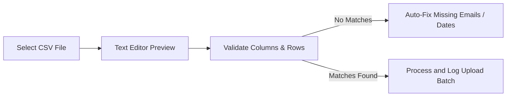

# 📥 CSV Batch Upload & Error Resolution System

SplitFlow Pro features a robust drag-and-drop CSV importer that reads, previews, validates, and imports transactions in batches.

---

## 📋 CSV Format Template

For successful imports, files must match this comma-separated format:

```csv
Date,Description,Category,Amount,PaidBy
2026-06-15,Office Luncheon,Food,120.00,priya@example.com
2026-06-16,Electricity Bill,Bills,85.50,rahul@example.com
2026-06-17,Cab Ride,Transport,24.00,aman@example.com
```

---

## ⚙️ Parsing Pipeline & Validation



### 1. File Upload & Text Preview
- Users can drag and drop or select files.
- The raw CSV content displays inside an editable textbox container, allowing manual tweaks before submission.

### 2. Validation & Auto-Fixing
The parser reviews every uploaded row on the backend:
- **Missing Emails**: Auto-assigns the uploader/current user as the payer if the `PaidBy` field is empty or contains an invalid email.
- **Dates**: Resolves empty or mismatched date formats to the current date.
- **Amount**: Normalizes negative values or non-numeric entries (sets a default minimum or strips invalid characters).

### 3. Batch Logging & Reports
- Every processed upload saves as a named batch in the database (e.g. `Batch-20260615-1045`).
- The **Reports** tab lists all batches. Users can review batch stats or click the red trash icon to delete the entire batch, which automatically rolls back and deletes all corresponding imported transactions from the ledger.
